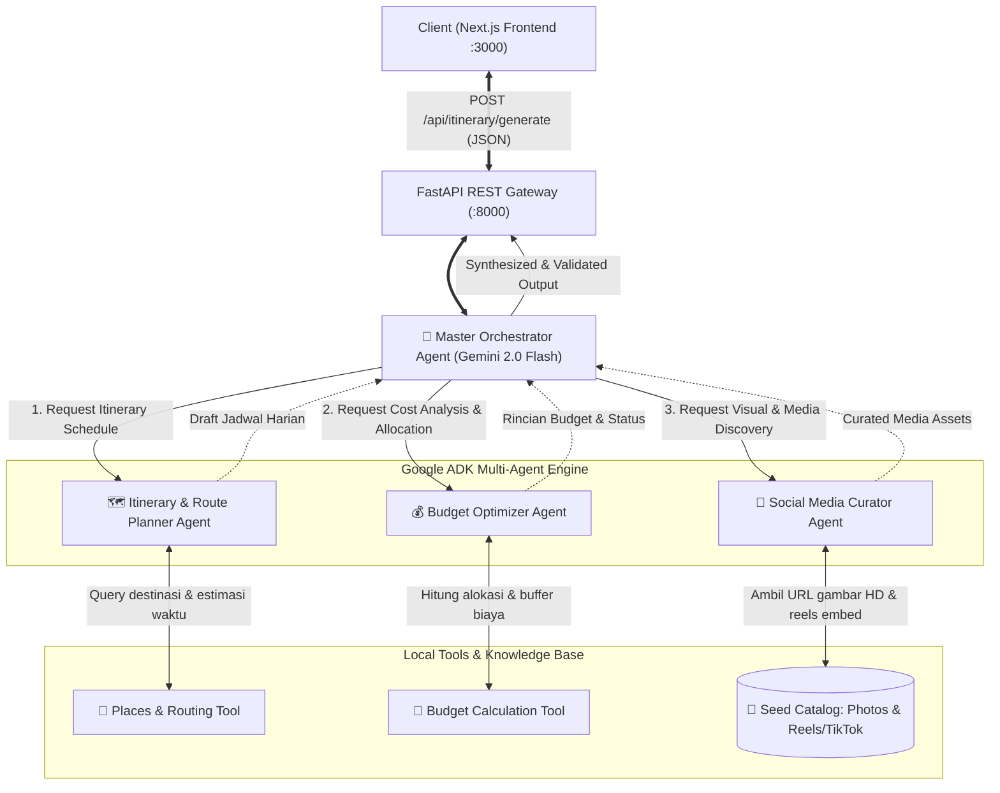

# 📋 Rencana Implementasi Sistem: KemanaYa AI
*Smart Multi-Agent Vacation Planner & Visual Recommender*

---

## 1. Ringkasan Eksekutif & Strategi Tim

Proyek **KemanaYa AI** dirancang untuk mendemonstrasikan sistem rekomendasi dan perencana liburan cerdas berbasis **Multi-Agent AI** dengan pendekatan **Full Local Development**. Sistem ini membagi peran secara jelas antara **Frontend** (rekan tim) serta **Backend & AI Orchestration** (Anda), sehingga kedua belah pihak dapat mengembangkan modul masing-masing secara independen melalui kontrak data (API Contract) yang telah disepakati.

### Matriks Pembagian Tanggung Jawab

| Domain | Penanggung Jawab | Tech Stack | Ruang Lingkup & Deliverable |
| :--- | :--- | :--- | :--- |
| **Frontend UI/UX** | **Rekan Tim** | Next.js 14+ (App Router), Tailwind CSS, Shadcn UI, TypeScript, Lucide Icons | • Halaman Input Preferensi Liburan (Tujuan, Hari, Budget, Tags)<br>• Tampilan Itinerary Harian (Timeline & Waktu Kegiatan)<br>• Media Discovery Card (Preview Foto & Modal Video Reels/TikTok)<br>• Budget Breakdown Visualization (Chart / Bar alokasi biaya)<br>• Integrasi API ke `http://localhost:8000` |
| **Backend Gateway** | **Anda** | Python 3.12, FastAPI, Pydantic v2, Uvicorn | • REST API Gateway (`/api/itinerary/generate`, `/api/itinerary/adjust-budget`, `/api/destinations`, `/api/health`)<br>• Konfigurasi CORS (Origin Next.js `localhost:3000`)<br>• Validasi skema input/output Pydantic<br>• Local caching & seeding database mock tempat wisata |
| **AI Orchestration** | **Anda** | Google ADK (Agent Development Kit), Gemini 2.0 SDK, Custom Tools | • **Master Orchestrator Agent**: Koordinator alur multi-agent<br>• **Itinerary & Route Planner Agent**: Penjadwalan hari & efisiensi rute<br>• **Budget Optimizer Agent**: Kalkulasi alokasi & pencegahan overbudget<br>• **Social Media Curator Agent**: Kurasi foto HD & tautan video reels/TikTok<br>• Custom Tools & Function Calling |

---

## 2. Arsitektur AI Orchestration (Google ADK)

Arsitektur AI mengadopsi pola **Hierarchical Multi-Agent with Specialized Tool Calling** menggunakan Google Agent Development Kit (ADK).



### Spesifikasi Agent:

#### A. 🎯 Master Orchestrator Agent
- **Model**: `gemini-2.0-flash`
- **Tanggung Jawab**:
  1. Menerima payload permintaan perjalanan dari pengguna (`destination`, `duration_days`, `budget`, `preferences`).
  2. Mengaktifkan sub-agent secara terstruktur (Planner $\rightarrow$ Budget $\rightarrow$ Media Curator).
  3. Memastikan integritas data antar-agen (misalnya, memastikan destinasi yang dihitung biayanya oleh Budget Agent identik dengan destinasi di jadwal Planner Agent).
  4. Merangkum seluruh luaran menjadi respons JSON tunggal yang tervalidasi skema.

#### B. 🗺️ Itinerary & Route Planner Agent
- **Fokus**: Geografi, efisiensi waktu, dan variasi aktivitas.
- **Tugas**:
  - Mengelompokkan destinasi berdasarkan kedekatan wilayah agar rute harian tidak bolak-balik.
  - Membagi jadwal dalam 4 slot waktu harian: *Morning* (08:30 - 11:30), *Afternoon* (12:00 - 15:30), *Evening* (16:00 - 19:00), *Night* (19:30 - 22:00).
- **Tool**: `get_places_by_destination(city, categories)` dan `cluster_routes(places)`.

#### C. 💰 Budget Optimizer Agent
- **Fokus**: Realisme finansial dan optimasi alokasi.
- **Tugas**:
  - Membagi budget pengguna ke dalam 5 pos utama:
    1. Akomodasi / Penginapan ($\approx 30\% - 40\%$)
    2. Kuliner & Makan ($\approx 25\% - 30\%$)
    3. Tiket Masuk & Aktivitas ($\approx 15\% - 20\%$)
    4. Transportasi Lokal ($\approx 10\% - 15\%$)
    5. Cadangan Darurat / Buffer ($\approx 5\% - 10\%$)
  - Mengeluarkan status kalkulasi: `is_within_budget` (`true`/`false`) beserta catatan penyesuaian jika budget pengguna terlalu minim.
- **Tool**: `calculate_budget_allocation(total_budget, days, activities_cost)`.

#### D. 📸 Social Media Curator Agent
- **Fokus**: Kurasi visual nyata (menjawab masalah rekomendasi teks kaku).
- **Tugas**:
  - Menghubungkan setiap tempat wisata dengan tautan gambar HD (Unsplash / Google Places) dan cuplikan media sosial (Instagram Reels, TikTok, YouTube Shorts).
  - Menyertakan rating ulasan Google dan kutipan sentimen pengguna media sosial.
- **Tool**: `fetch_place_social_media(place_names)`.

---

## 3. Kontrak Data API (Interface Frontend & Backend)

Kontrak ini menjadi acuan bersama agar rekan frontend dapat langsung membuat antarmuka dan mock state.

### A. Endpoint Spesifikasi

| Method | Endpoint | Fungsi | Payload Utama |
| :--- | :--- | :--- | :--- |
| `GET` | `/api/health` | Cek status server & AI engine | - |
| `GET` | `/api/destinations` | Mengambil daftar destinasi demo populer | - |
| `POST` | `/api/itinerary/generate` | Generate jadwal lengkap + media + budget | `PlanRequest` |
| `POST` | `/api/itinerary/adjust-budget` | Hitung ulang rekomendasi saat budget digeser | `BudgetAdjustRequest` |

---

### B. TypeScript Schema (Untuk Frontend Next.js)

```typescript
// types/itinerary.ts

export type TimeSlot = "morning" | "afternoon" | "evening" | "night";

export type ActivityCategory =
  | "wisata_alam"
  | "kuliner"
  | "budaya"
  | "relaksasi"
  | "hiburan";

export type SocialPlatform =
  | "instagram"
  | "tiktok"
  | "youtube_shorts"
  | "google_places";

export interface PlanRequest {
  destination: string;         // Contoh: "Bali", "Yogyakarta", "Bandung", "Labuan Bajo"
  duration_days: number;       // Contoh: 3
  budget: number;              // Contoh: 5000000 (IDR)
  travelers_count?: number;    // Default: 1
  preferences: string[];       // Contoh: ["Pantai", "Sunset", "Kuliner Lokal", "Hidden Gems"]
}

export interface SocialMediaAsset {
  platform: SocialPlatform;
  media_type: "video" | "image";
  url: string;                 // URL video reels atau post
  thumbnail_url: string;       // Foto preview resolusi tinggi
  creator_username?: string;   // Contoh: "@balitrip_guide"
  caption_snippet?: string;    // Contoh: "Spot sunset tercantik dan belum ramai di Canggu!"
  likes_or_views?: string;     // Contoh: "240K views"
}

export interface ActivityItem {
  id: string;
  time_slot: TimeSlot;
  time_range: string;          // Contoh: "09:00 - 11:30"
  place_name: string;
  category: ActivityCategory;
  description: string;
  estimated_cost: number;      // Tiket / perkiraan makan per orang (IDR)
  google_rating?: number;      // Contoh: 4.8
  reviews_count?: number;      // Contoh: 1420
  address?: string;
  media: SocialMediaAsset[];   // Foto & video reels/shorts
}

export interface DayItinerary {
  day_number: number;
  theme: string;               // Contoh: "Eksplorasi Tebing & Pantai Eksotis Bali Selatan"
  activities: ActivityItem[];
  daily_estimated_cost: number;
}

export interface BudgetCategory {
  category: "accommodation" | "food_beverage" | "transportation" | "activities_tickets" | "emergency_buffer";
  label: string;               // Contoh: "Penginapan & Hotel"
  amount: number;              // Contoh: 1800000
  percentage: number;          // Contoh: 36
}

export interface BudgetSummary {
  total_budget: number;
  total_estimated_cost: number;
  remaining_budget: number;
  is_within_budget: boolean;
  status_message: string;      // Contoh: "Budget Anda ideal untuk paket liburan ini."
  breakdown: BudgetCategory[];
}

export interface PlanResponse {
  trip_id: string;
  destination: string;
  duration_days: number;
  trip_summary: string;
  itinerary: DayItinerary[];
  budget_summary: BudgetSummary;
  travel_tips: string[];
}
```

---

## 4. Struktur Direktori Lengkap Proyek

```text
kemanaya/
├── application_design.md          # Dokumen desain awal sistem
├── IMPLEMENTATION_PLAN.md         # Dokumen implementasi lengkap (file ini)
├── FRONTEND_INTEGRATION_GUIDE.md  # Panduan khusus developer frontend
├── frontend_types/
│   └── itinerary.ts               # File definisi TypeScript siap import
└── backend/
    ├── app/
    │   ├── __init__.py
    │   ├── main.py                # FastAPI entrypoint & router
    │   ├── config.py              # Konfigurasi & pembacaan env
    │   ├── schemas/
    │   │   ├── __init__.py
    │   │   └── itinerary.py       # Pydantic v2 schemas
    │   ├── agents/
    │   │   ├── __init__.py
    │   │   ├── base.py            # ADK setup & smart fallback engine
    │   │   ├── orchestrator.py    # Master coordinator agent
    │   │   ├── planner.py         # Sub-agent: itinerary & route
    │   │   ├── budget.py          # Sub-agent: budget optimizer
    │   │   └── media_curator.py   # Sub-agent: social media visual curator
    │   ├── tools/
    │   │   ├── __init__.py
    │   │   ├── places_tool.py     # Tool pencarian tempat wisata lokal
    │   │   └── budget_tool.py     # Tool kalkulator finansial
    │   └── data/
    │       └── places_seed.json   # Seed database tempat + foto + URL reels
    ├── tests/
    │   └── test_api.py            # Test script endpoint lokal
    ├── requirements.txt           # Python packages
    ├── .env.example               # Template environment variables
    └── run.py                     # Script runner FastAPI lokal
```

---

## 5. Rencana Tahapan Eksekusi (Implementation Steps)

### Tahap 1: Setup Lingkungan & Database Seed Lokal
1. Memastikan file `requirements.txt` dan `.env.example` terkonfigurasi.
2. Menyusun database seed `backend/app/data/places_seed.json` yang berisi 30+ destinasi populer (Bali, Yogyakarta, Bandung, Labuan Bajo) yang sudah dilengkapi koordinat, rating Google, estimasi biaya tiket, dan aset visual (foto HD & link video reels/TikTok).

### Tahap 2: Definisi Skema Pydantic & Custom Tools
1. Mengimplementasikan skema `backend/app/schemas/itinerary.py` agar sinkron dengan kontrak TypeScript frontend.
2. Membangun `places_tool.py` untuk memfilter tempat berdasarkan kota, kategori, dan preferensi pengguna.
3. Membangun `budget_tool.py` untuk melakukan perhitungan matematis pembagian alokasi biaya secara presisi.

### Tahap 3: Implementasi Multi-Agent Google ADK
1. Membangun wrapper ADK di `backend/app/agents/base.py` yang mendukung **Gemini 2.0 Flash** serta memiliki **Smart Fallback Engine** (sehingga jika API Key belum dipasang saat demo lokal, aplikasi tetap berjalan mulus dengan data realistis).
2. Membangun sub-agent: `planner.py`, `budget.py`, dan `media_curator.py`.
3. Membangun koordinator utama di `orchestrator.py` untuk mengonsolidasikan hasil sub-agent menjadi satu struktur data utuh.

### Tahap 4: FastAPI Gateway & REST Endpoints
1. Mengonfigurasi `backend/app/main.py` dengan middleware CORS aktif untuk `http://localhost:3000` (Next.js).
2. Menyediakan endpoint:
   - `GET /api/health`
   - `GET /api/destinations`
   - `POST /api/itinerary/generate`
   - `POST /api/itinerary/adjust-budget`

### Tahap 5: Verifikasi & Uji Integrasi
1. Menjalankan server lokal `python run.py`.
2. Melakukan pengetesan payload via script `tests/test_api.py`.
3. Memverifikasi Swagger UI di `http://localhost:8000/docs` agar rekan frontend siap melakukan tes langsung dari browser.

---

## 6. Panduan untuk Rekan Frontend (Next.js)

Rekan tim Anda dapat mengikuti petunjuk di [FRONTEND_INTEGRATION_GUIDE.md](file:///d:/google/kemanaya/FRONTEND_INTEGRATION_GUIDE.md):
- Menyalin tipe TypeScript dari [frontend_types/itinerary.ts](file:///d:/google/kemanaya/frontend_types/itinerary.ts).
- Membuat antarmuka pengguna berbasis komponen modular (Input Form, Itinerary Timeline, Media Card, Budget Breakdown).
- Melakukan pemanggilan API ke `http://localhost:8000/api/itinerary/generate`.
