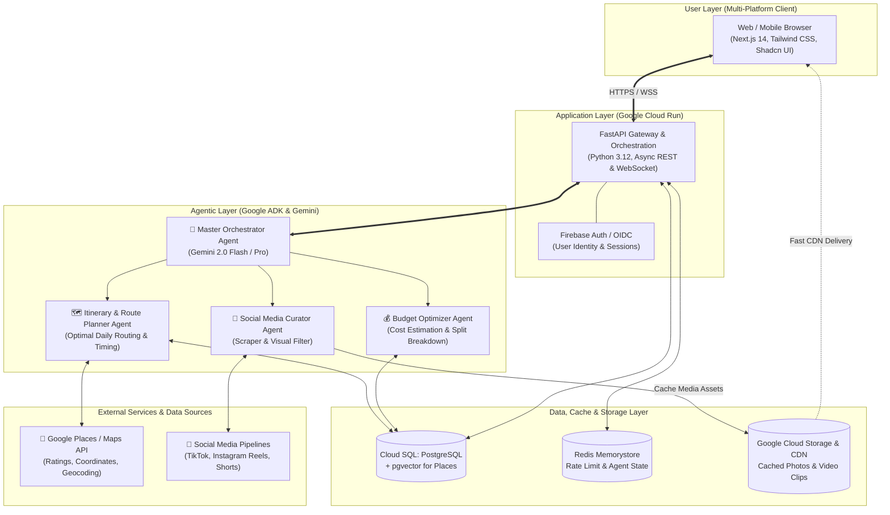

# Application Design

## General Information

| Field | Details / Team Input |
| :--- | :--- |
| **Group Name / Number** | Pusing Pengen Liburan |
| **Team Members & Roles** | *(Dikosongkan untuk diisi nanti)* |
| **Project Name** | **KemanaYa AI** — *Smart Multi-Agent Vacation Planner & Visual Recommender* *(Filosofi: berasal dari celetukan spontan saat bingung liburan: "kemana yaaa...")* |

---

## Product Overview & MVP Scope

| Section | Description & Group Input |
| :--- | :--- |
| **Problem Statement** | Merencanakan liburan seringkali melelahkan dan memakan waktu berhari-hari (*decision fatigue*). Rekomendasi tempat wisata yang ada di pasaran umumnya hanya berupa teks kaku tanpa bukti visual nyata, perkiraan budget sering meleset atau tidak transparan, serta rute harian yang disusun manual kerap tidak efisien (bolak-balik antar lokasi). Pengguna butuh gambaran visual riil (foto/video suasana terkini) dari media sosial sebelum yakin menentukan pilihan. |
| **Target Audience** | 1. **Solo Traveler & Backpacker**: Membutuhkan rekomendasi fleksibel, optimal secara rute dan biaya. 2. **Wisatawan Umum**: Memerlukan *all-in-one trip planner* otomatis tanpa repot riset manual. 3. **Pemburu Hidden Gems & Pecinta Kuliner**: Membutuhkan kurasi tempat unik, viral, dan estetik dengan referensi visual nyata. |
| **Core Value Proposition** | Asisten liburan otonom bertenaga **Multi-Agent AI** yang tidak hanya menyusun jadwal perjalanan (*itinerary*) dan optimasi budget secara otomatis, tetapi juga **secara cerdas mengkurasi cuplikan gambar dan video suasana nyata dari media sosial & Google Places**, memberikan pengalaman perencanaan liburan yang hidup, visual, dan terukur. |
| **Key User Stories (MVP)** | **1. End-to-End Itinerary Generation**: Sebagai pengguna, saya dapat memasukkan destinasi tujuan, durasi liburan, rentang budget, dan preferensi aktivitas (kuliner, santai, alam, hidden gems) agar AI menyusun jadwal harian yang optimal beserta estimasi rute perjalanan.  **2. Visual & Social Media Discovery**: Sebagai pengguna, saya dapat melihat kartu rekomendasi destinasi yang dilengkapi foto dan cuplikan video nyata dari media sosial (Instagram Reels/TikTok/Shorts) serta ulasan Google Places sebelum memutuskan menambahkannya ke dalam *bucket list* itinerary.  **3. Dynamic Budget Breakdown & Adjustment**: Sebagai pengguna, saya dapat melihat rincian alokasi biaya transparan (transportasi, akomodasi, tiket masuk, kuliner) dan mengubah destinasi secara fleksibel di mana sub-agent akan otomatis menghitung ulang sisa budget dan jadwal secara *real-time*. |

---

## Technology Stack

| Aspect | Technology |
| :--- | :--- |
| **Programming Language** | **Python 3.12** (AI Backend & Multi-Agent Engine) dan **TypeScript** (Frontend & Data Types) |
| **Backend Framework** | **FastAPI** (High-performance asynchronous REST API & WebSocket untuk streaming respon agen) |
| **Frontend Framework** | **Next.js 14+** (React, App Router, Tailwind CSS, Shadcn UI — responsif untuk Web & Mobile Browser) |
| **Agentic Framework** | **Google Agent Development Kit (ADK) / Gemini 2.0 SDK** dengan arsitektur multi-agent terkoordinasi (*Orchestrator Agent*, *Planner Agent*, *Budget Agent*, dan *Social Media Scraper/Curator Agent*) |
| **Other Tools & Infrastructure** | • **Cloud Run**: Serverless container deployment untuk backend FastAPI & frontend Next.js. • **Cloud Storage + Cloud CDN**: Caching aset visual (gambar & thumbnail video) hasil scraping/API agar cepat diakses dan hemat bandwidth. • **Google Cloud SQL (PostgreSQL + pgvector)**: Penyimpanan data user, bookmark itinerary, dan vector embeddings untuk semantic search tempat wisata. • **Redis (Cloud Memorystore)**: Session caching, rate-limiting scraping, dan task queue status agent. • **External APIs**: Google Places API (lokasi, rating, jam buka), Instagram Graph API / YouTube Data API / Scraper Engine. |

---

## Architecture

